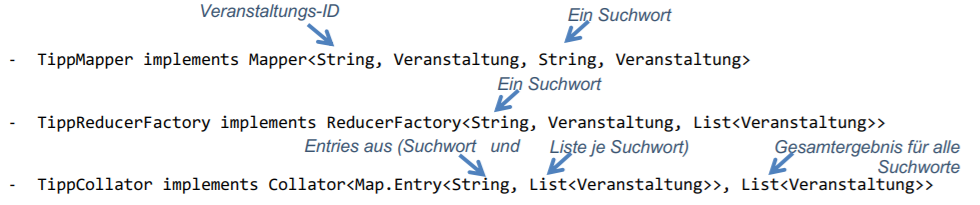
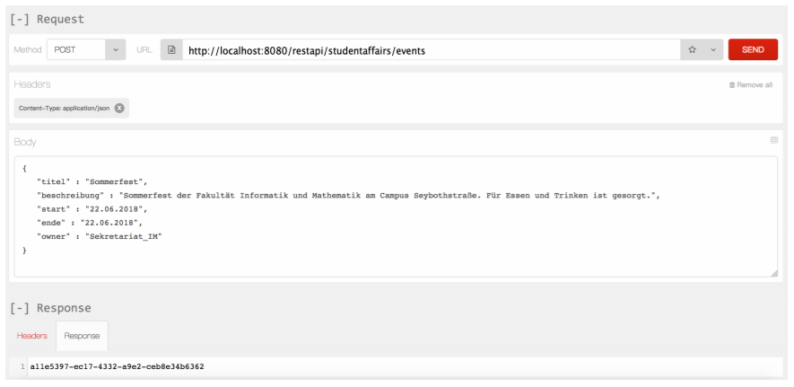
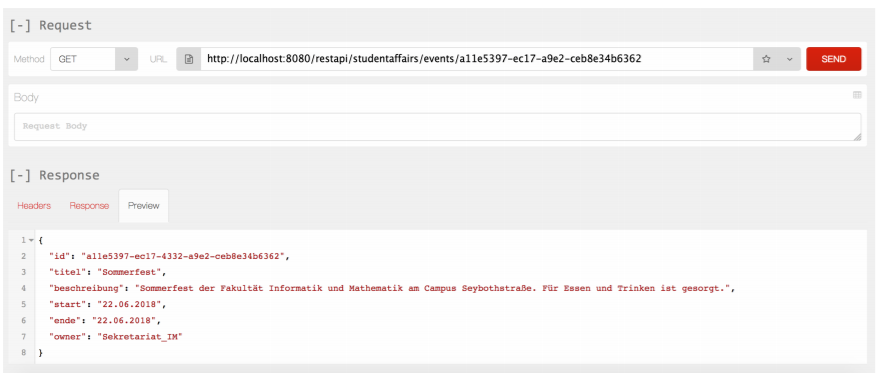

# Verteilte Systeme: Im Memory Data Grid und der MapReduce-Algorithmus
##### [Hazelcast-Dokumatation](https://docs.hazelcast.org/docs/3.7.8/manual/html-single/)

##Aufgabe: MapReduce 
Im neuen Package `de.othr.vs.xml` finden Sie auch die Klasse `Veranstaltung`. Diese
repräsentiert eine Veranstaltung bzw. einen Veranstaltungstipp und sieht in etwa wie
folgt aus:
```java
@XmlRootElement
@XmlAccessorType(XmlAccessType.FIELD)
public class Veranstaltung implements Serializable {
 private static final long serialVersionUID = 1L;
 private String id;
 private String titel;
 private String beschreibung;
 private Date start;
 private Date ende;
 private String owner;
 // ...
}
```
Erstellen Sie eine neue Klasse `VeranstaltungService`. Diese soll die REST-Schnittstelle
für „POST“ und „GET“ für Veranstaltungen implementieren. Die Veranstaltung-Objekte
sollen in einer IMap namens `"veranstaltungen"` im Hazelcast-Data-Grid gespeichert
bzw. daraus gelesen werden.
Die Resource-URI könnte wie folgt lauten: `/restapi/studentaffairs/events/{id}`
Beispielaufrufe siehe Folgeseiten!
Für eine Query von Veranstaltungen über Schlüsselwörter müssen nun alle „Nodes“ im
Hazelcast-Cluster abgefragt werden, da die Veranstaltungsobjekte über alle Knoten
verteilt gespeichert werden.
Dabei sollen Veranstaltungen gefunden werden, deren Titel oder Beschreibung
mindestens eines der übergebenen Suchworte enthalten. Das Ergebnis des Algorithmus
ist eine `List<Veranstaltung>` mit allen Veranstaltungen, die zu den Suchwörtern
passen.
Die Resource-URI könnte wie folgt lauten:
`/restapi/studentaffairs/events?search=Musik+Regensburg`
Erstellen Sie hierzu folgende Klassen:


Die Klasse `TippMapper` benötigt zusätzlich noch folgenden Konstruktor zur Übergabe
der Suchwörter: `public TippMapper(String[] suchwoerter)`
Die Ergebnisliste kann (muss aber nicht) nach Relevanz sortiert werden. Es sollten
grundsätzlich nur Veranstaltung berücksichtigt werden, die noch nicht abgeschlossen
sind.
Hinzufügen einer neuen Veranstaltung:


http://localhost:8080/restapi/studentaffairs/events/a11e5397-ec17-a9e2-ceb8e34b6362
Abfragen der Details zu einer Veranstaltung (über dessen kryptische UUID):


Start einer MapReduce-Anfrage für Veranstaltungstipps zu den Suchwörtern Musik und
Regensburg:
http://localhost:8080/restapi/studentaffairs/events?search=Musik+Regensburg

